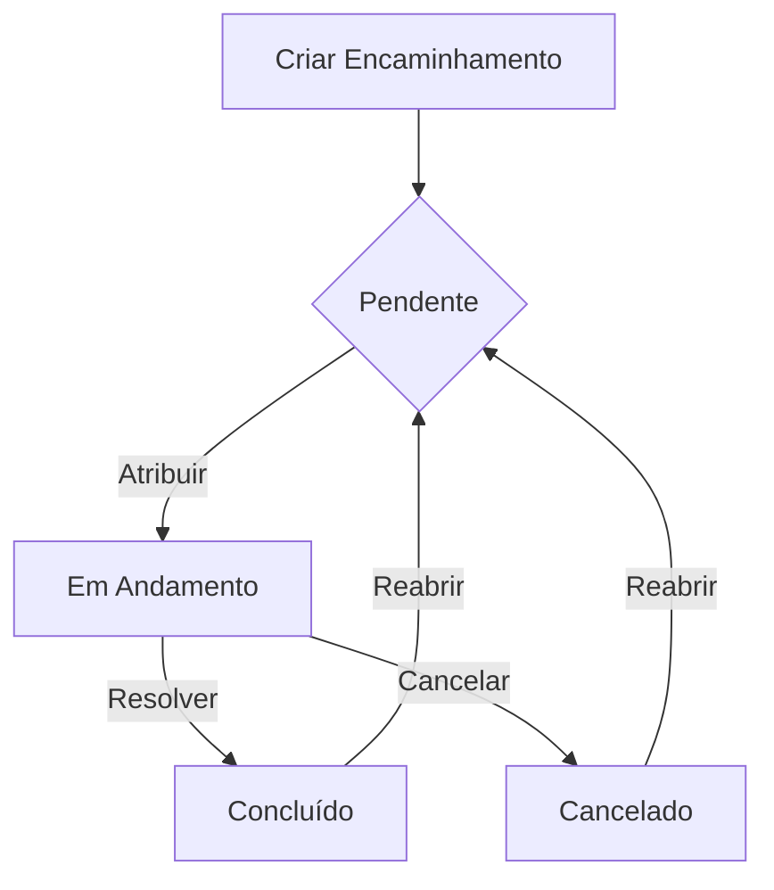

# Fluxo de Trabalho

## Visão Geral

O sistema de encaminhamentos segue um fluxo de trabalho estruturado para garantir o acompanhamento eficiente e organizado dos encaminhamentos. Este documento descreve os principais fluxos, estados e transições do sistema.

## Estados do Encaminhamento

### 1. Pendente (Pending)
- Estado inicial ao criar um encaminhamento
- Aguardando atribuição ou início do atendimento
- Pode ter prioridade definida
- Permite edição de todos os campos

### 2. Em Andamento (In Progress)
- Encaminhamento está sendo atendido
- Possui responsável designado
- Permite adição de comentários e anexos
- Permite atualização de status

### 3. Concluído (Completed)
- Atendimento finalizado
- Requer descrição da resolução
- Mantém histórico completo
- Permite reabertura se necessário

### 4. Cancelado (Cancelled)
- Encaminhamento interrompido
- Requer justificativa
- Mantém registro para análise
- Permite reabertura em casos específicos

## Fluxo Principal

## Transições de Estado

### De Pendente para Em Andamento
- Requer atribuição de responsável
- Define data inicial de atendimento
- Notifica responsável e interessados
- Permite definição de prazo

### De Em Andamento para Concluído
- Requer descrição da resolução
- Registra data de conclusão
- Notifica criador e interessados
- Gera métricas de atendimento

### De Em Andamento para Cancelado
- Requer justificativa
- Registra data de cancelamento
- Notifica envolvidos
- Mantém histórico

### Reabertura
- Disponível para estados Concluído e Cancelado
- Requer justificativa
- Retorna ao estado Pendente
- Mantém histórico anterior

## Notificações

### Eventos que Geram Notificações
1. Criação de encaminhamento
2. Atribuição de responsável
3. Mudança de status
4. Adição de comentários
5. Anexação de arquivos
6. Alteração de prioridade
7. Proximidade do prazo
8. Conclusão ou cancelamento

### Tipos de Notificação
- Email
- Notificação no sistema
- Mensagem no chat
- Alerta no dashboard

## Prioridades

### Níveis
1. Baixa (Low)
   - Prazo flexível
   - Sem impacto imediato

2. Média (Medium)
   - Prazo definido
   - Impacto moderado

3. Alta (High)
   - Prazo curto
   - Impacto significativo

4. Urgente (Urgent)
   - Atenção imediata
   - Alto impacto

### Regras de Priorização
- Baseadas no tipo de encaminhamento
- Consideram prazo e impacto
- Podem ser ajustadas por gestores
- Afetam ordem de exibição

## Permissões

### Níveis de Acesso
1. Administrador
   - Acesso total ao sistema
   - Gerencia usuários e permissões
   - Define configurações globais

2. Gestor
   - Visualiza todos os encaminhamentos
   - Atribui responsáveis
   - Ajusta prioridades
   - Acessa relatórios

3. Atendente
   - Visualiza encaminhamentos atribuídos
   - Atualiza status
   - Adiciona comentários
   - Anexa arquivos

4. Usuário
   - Cria encaminhamentos
   - Visualiza próprios encaminhamentos
   - Adiciona comentários
   - Recebe notificações

### Matriz de Permissões

| Ação                    | Admin | Gestor | Atendente | Usuário |
|------------------------|-------|---------|-----------|----------|
| Criar                  | ✓     | ✓       | ✓         | ✓        |
| Visualizar Todos       | ✓     | ✓       | -         | -        |
| Atribuir               | ✓     | ✓       | -         | -        |
| Editar Status          | ✓     | ✓       | ✓         | -        |
| Editar Prioridade      | ✓     | ✓       | -         | -        |
| Adicionar Comentários  | ✓     | ✓       | ✓         | ✓        |
| Anexar Arquivos        | ✓     | ✓       | ✓         | ✓        |
| Gerar Relatórios       | ✓     | ✓       | -         | -        |
| Configurar Sistema     | ✓     | -       | -         | -        |

## Métricas e KPIs

### Tempo de Atendimento
- Tempo médio de resolução
- Tempo em cada status
- Distribuição por prioridade
- Comparativo por período

### Volume
- Total de encaminhamentos
- Distribuição por status
- Distribuição por tipo
- Tendências temporais

### Qualidade
- Taxa de resolução
- Taxa de reabertura
- Satisfação do usuário
- Tempo de primeira resposta

### Produtividade
- Encaminhamentos por atendente
- Tempo médio por atendimento
- Taxa de conclusão
- Eficiência por tipo

## Relatórios

### Tipos de Relatório
1. Operacional
   - Status atual
   - Pendências
   - Prazos próximos
   - Atividade diária

2. Gerencial
   - Indicadores de desempenho
   - Análise de tendências
   - Distribuição de carga
   - Comparativos

3. Estratégico
   - Análise de padrões
   - Oportunidades de melhoria
   - Previsões
   - Impacto no negócio

### Periodicidade
- Diários
- Semanais
- Mensais
- Trimestrais
- Anuais

## Integrações

### Sistemas Internos
1. Gestão de Usuários
   - Autenticação
   - Permissões
   - Dados de perfil

2. Comunicação
   - Email
   - Chat
   - Notificações

3. Documentação
   - Base de conhecimento
   - Procedimentos
   - Templates

### APIs Externas
1. Serviços de Email
2. Sistemas de Chat
3. Armazenamento em Nuvem
4. Análise de Dados

## Manutenção

### Rotinas
1. Backup de dados
2. Limpeza de cache
3. Atualização de índices
4. Verificação de integridade

### Monitoramento
1. Performance
2. Disponibilidade
3. Erros
4. Segurança

## Ciclo de Vida

### 1. Criação
- Preenchimento de dados
- Validação de campos
- Definição de prioridade
- Notificação inicial

### 2. Triagem
- Análise inicial
- Categorização
- Atribuição
- Definição de prazo

### 3. Atendimento
- Análise detalhada
- Execução de ações
- Registro de atividades
- Comunicação

### 4. Conclusão
- Resolução
- Documentação
- Notificação
- Arquivamento

### 5. Pós-atendimento
- Avaliação
- Feedback
- Análise de métricas
- Identificação de melhorias
